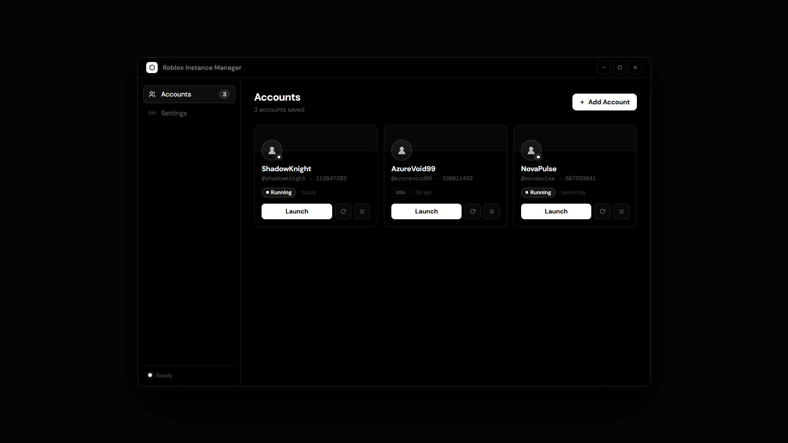

# Roblox Instance Manager

<p align="center">
  <a href="docs/preview.html">
    
  </a>
</p>


A desktop application for running multiple Roblox clients simultaneously under separate accounts. Built with Electron on Windows.

---

## How it works

Roblox uses a named Win32 mutex (`ROBLOX_singletonEvent`) to detect whether another instance is already running. When a second client starts, it checks for this mutex and exits if it already exists -this is the singleton guard.

This application pre-creates that mutex at startup via a background PowerShell process using `new System.Threading.Mutex($false, "ROBLOX_singletonEvent")`. The `$false` parameter means the mutex is created without claiming ownership. Every subsequent Roblox client then finds the mutex already present, skips the singleton check, and launches normally. The mutex is held for the entire lifetime of the app and released cleanly on exit.

Each account authenticates independently through Roblox's auth ticket flow:

1. An unauthenticated POST to `auth.roblox.com/v1/authentication-ticket` returns a `x-csrf-token` header.
2. A second POST with that CSRF token and the account's `.ROBLOSECURITY` cookie returns an `rbx-authentication-ticket` header.
3. The ticket is embedded into a `roblox-player://` URI that is opened via `shell.openExternal`, which hands off to the Roblox bootstrapper.

No Roblox files are modified. No memory is patched. The approach is equivalent to what [MultiBloxy](https://github.com/Zgoly/MultiBloxy) does.

---

## Tech stack

<p align="left">
  
  
  
  
  
  
  
  
</p>

| Layer | Technology |
|---|---|
| Desktop shell | [Electron](https://www.electronjs.org/) v29 |
| UI | Vanilla JS + [Tailwind CSS](https://tailwindcss.com/) via CDN |
| Token encryption | AES-256-GCM via Node.js `crypto` |
| Machine binding | [node-machine-id](https://github.com/automation-stack/node-machine-id) |
| Mutex management | PowerShell / Win32 `System.Threading.Mutex` |
| Packaging | [electron-builder](https://www.electron.build/) |

---

## Security model

Session tokens are never stored in plaintext. The encryption key is derived from the machine's hardware ID using `node-machine-id`, meaning the `accounts.json` file produced by this app cannot be decrypted on a different machine.

Each token is encrypted with a random 16-byte IV and a 16-byte GCM authentication tag:

```
stored format:  <iv_hex>:<tag_hex>:<ciphertext_hex>
cipher:         AES-256-GCM
key derivation: SHA-256(machineId)
```

The renderer process runs with `contextIsolation: true` and `nodeIntegration: false`. All IPC is exposed through a typed `contextBridge` preload. The renderer has no access to Node.js APIs directly.

---

## Project structure

```
.
├── main.js                   # Electron main process, all IPC handlers
├── preload.js                # contextBridge API surface exposed to renderer
├── services/
│   ├── accountManager.js     # CRUD for accounts; never exposes encrypted tokens
│   ├── encryption.js         # AES-256-GCM encrypt/decrypt
│   ├── instanceManager.js    # PowerShell process polling for RobloxPlayerBeta
│   ├── mutexHolder.js        # Spawns PS process that holds ROBLOX_singletonEvent
│   ├── robloxApi.js          # Token validation, avatar fetch via Roblox REST API
│   ├── robloxLauncher.js     # Auth ticket flow + roblox-player:// URI construction
│   ├── robloxStateGuard.js   # Backs up and restores LocalStorage to prevent cross-instance sign-outs
│   └── storage.js            # JSON file persistence in app.getPath('userData')
└── src/
    ├── index.html            # App shell, Tailwind config, global CSS
    └── js/
        ├── app.js            # Router, boot sequence
        ├── state.js          # Shared in-memory state (accounts, settings)
        ├── utils.js          # escHtml, avatarFallback, formatDuration
        ├── components/
        │   ├── modal.js
        │   └── toast.js
        └── pages/
            ├── accounts.js   # Account grid, add/remove/launch/refresh avatar
            └── settings.js   # Multi-instance toggle, launch delay, danger zone
```

---

## Building from source

**Prerequisites**

- Node.js 18 or later
- Windows 10/11 (the mutex and PowerShell components are Windows-only)

**Install dependencies**

```bash
npm install
```

**Run in development**

```bash
npm start
```

**Build a distributable installer**

```bash
npm run dist
```

This invokes `electron-builder` and produces an NSIS installer under `dist/`. The output binary is self-contained -no Node.js installation is required on the target machine.

**Build output**

```
dist/
  Roblox Instance Manager Setup 1.0.0.exe   # NSIS installer
  win-unpacked/                             # Unpacked app directory
```

---

## Usage

1. Launch the app.
2. Go to **Accounts** and click **Add Account**.
3. Open `roblox.com` in a browser, open DevTools, navigate to **Application > Cookies**, and copy the `.ROBLOSECURITY` cookie value.
4. Paste the token into the input field and click **Add Account**. The token is validated against the Roblox API before being stored.
5. Click **Launch** on any account card. Roblox opens authenticated to the home screen -navigate to any game from within the client.

Repeat step 5 for each account. Add every account you want to run (including your main account) through the app. Because the mutex is held by this app, each Roblox instance starts cleanly without interfering with the others. Mixing app-launched instances with instances opened normally outside the app will cause session sharing issues.

---

## Limitations

- Windows only. The mutex mechanism relies on Win32 named mutexes; the app will run on other platforms but multi-instance will not function.
- The `.ROBLOSECURITY` token expires when you log out of Roblox on that browser session. Re-add the account if a token stops working.
- Roblox may change their auth ticket API without notice. If launching stops working, check whether `auth.roblox.com/v1/authentication-ticket` still returns the `rbx-authentication-ticket` header.

---

## License

MIT
